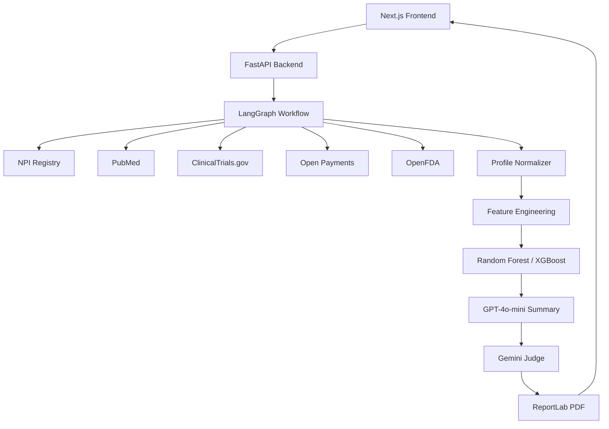

# HCP Intelligence Platform

AI-Powered Healthcare Professional Intelligence Platform — a full-stack application that profiles healthcare providers by NPI, aggregates multi-source data, predicts KOL influence with ML, and generates grounded AI summaries with quality evaluation.

## Architecture



## Tech Stack

| Layer | Technology |
|-------|-----------|
| Frontend | Next.js 15, TypeScript, Material UI |
| Backend | Python, FastAPI, Pydantic, httpx |
| AI Orchestration | LangGraph |
| LLM | Groq API (llama-3.1-8b-instant summaries) + Google Gemini (judge) |
| ML | scikit-learn, XGBoost, SHAP |
| PDF | ReportLab |
| Testing | pytest, pytest-asyncio |
| Deployment | Docker, docker-compose |

## Project Structure

```
HCP_Profiling/
├── backend/
│   ├── app/
│   │   ├── api/routes/       # FastAPI endpoints
│   │   ├── schemas/          # Pydantic models
│   │   ├── services/
│   │   │   ├── collectors/   # NPI, PubMed, ClinicalTrials, etc.
│   │   │   ├── ai/           # Summary + Judge
│   │   │   ├── ml/           # Feature engineering + prediction
│   │   │   └── pdf/          # Report generation
│   │   └── workflows/        # LangGraph pipeline
│   ├── tests/
│   ├── scripts/
│   └── Dockerfile
├── frontend/
│   ├── src/
│   │   ├── app/              # Next.js pages
│   │   ├── components/       # MUI components
│   │   ├── lib/              # API client
│   │   └── types/            # TypeScript interfaces
│   └── Dockerfile
├── docker-compose.yml
└── README.md
```

## Quick Start

### Prerequisites

- Python 3.12+
- Node.js 20+
- Groq API credentials (optional — fallback summaries work without)
- Google Gemini API key (optional — heuristic judge fallback works without)

### Backend

```bash
cd backend
python -m venv .venv
.\.venv\Scripts\activate        # Windows
pip install -r requirements.txt
copy .env.example .env        # Edit with your Groq and Gemini keys
python scripts/train_models.py
uvicorn app.main:app --reload --port 8000
```

### Frontend

```bash
cd frontend
npm install
copy .env.example .env.local
npm run dev
```

Open http://localhost:3000 and enter a 10-digit NPI (e.g., `1003000126`).

### Docker

```bash
cp backend/.env.example backend/.env   # Configure API keys
docker-compose up --build
```

## Environment Variables

| Variable | Description | Required |
|----------|-------------|----------|
| `GROQ_API_KEY` | Groq API key | For AI summaries |
| `GROQ_MODEL` | Groq model name | No (default: llama-3.1-8b-instant) |
| `GEMINI_API_KEY` | Google AI API key | For LLM judge |
| `GEMINI_JUDGE_MODEL` | Gemini model name | No (default: gemini-flash-latest) |
| `CORS_ORIGINS` | Allowed frontend origins | No |
| `NEXT_PUBLIC_API_URL` | Backend URL for frontend | No |

## API Endpoints

| Method | Path | Description |
|--------|------|-------------|
| GET | `/api/v1/health` | Health check |
| POST | `/api/v1/hcp/profile` | Generate full HCP profile |
| GET | `/api/v1/hcp/profile/{npi}/progress` | Pipeline progress |
| GET | `/api/v1/hcp/profile/{npi}/pdf` | Download PDF report |

### Example Request

```bash
curl -X POST http://localhost:8000/api/v1/hcp/profile \
  -H "Content-Type: application/json" \
  -d '{"npi": "1003000126"}'
```

## Pipeline Stages

1. **NPI Registry** — Provider identity, specialty, address
2. **Parallel Collection** — PubMed, ClinicalTrials.gov, Open Payments, OpenFDA
3. **Normalization** — Unified HCP profile schema
4. **Feature Engineering** — ML feature vector extraction
5. **ML Prediction** — Random Forest + XGBoost influence scoring
6. **AI Summary** — Grounded narrative via Groq API (llama-3.1-8b-instant)
7. **LLM Judge** — Quality evaluation via Google Gemini
8. **PDF Report** — Downloadable intelligence report

## Testing

```bash
cd backend
pytest -v
```

## ML Models

Models train on startup (or via `python scripts/train_models.py`) using a synthetic dataset derived from feature distributions. Both Random Forest and XGBoost are trained and compared; XGBoost is the default predictor.

Influence tiers:
- **Tier 1 KOL** — Score ≥ 75
- **Tier 2 KOL** — Score ≥ 50
- **Emerging Influencer** — Score ≥ 25
- **Standard HCP** — Score < 25

## Design Decisions

This is an **original implementation** inspired by (not copied from) the reference hackathon project. Key differences:

- **Clean layered architecture** vs. monolithic Streamlit scripts
- **LangGraph orchestration** with parallel data collection
- **Typed Pydantic schemas** throughout the pipeline
- **Async httpx collectors** with retry logic
- **Next.js + MUI** vs. Streamlit for production UI
- **Modular services** for AI, ML, PDF, and data collection

## License

MIT
